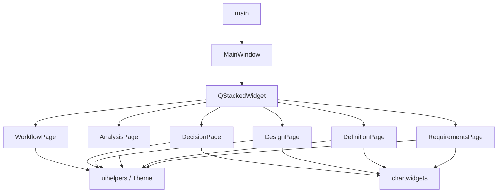

# 架构

## 现状

单进程 Qt Widgets：**main → MainWindow → 六个 Page → uihelpers / Theme / chartwidgets**。  
无 Presenter / Service / 持久层。演示数据在各 `*page.cpp`；操作多经 `wireDummyAction`。



**数据流**：源码字面量 → Page 构造组装 → 屏幕显示。无加载/保存/网络。表单可改，但不写回模型。Analysis 的 `allDomains()` 仅本文件静态数据。

**配置**：无运行时配置 / `QSettings` / 业务环境变量。CMake 固定 C++11、AUTOMOC/UIC/RCC、`Qt::Widgets`、include=`./ui`、MinGW UTF-8。硬编码：`Theme`、窗口尺寸、项目文案、各页演示字段。UI 上的「执行环境/许可证」等仅为演示，非真实配置。

链接依赖仅 `Qt::Widgets`。`mainwindow.ui` 未入构建。无 `.qrc`。根目录 PDF/XLSX/HTML（gitignore）不参与编译。

## 目录

```text
AMDO/
├── AGENTS.md
├── CMakeLists.txt          # 唯一工程描述
├── main.cpp
├── mainwindow.h/.cpp       # 实际主窗口
├── mainwindow.ui           # 未加入 PROJECT_SOURCES
├── ui/                     # 页面与公共 UI
│   ├── theme.h
│   ├── uihelpers.*
│   ├── chartwidgets.*
│   └── *page.*             # 六大功能页
├── docs/
└── build-mingw64/          # 本地构建产物（gitignore）
```

`PROJECT_SOURCES` 须与上表源文件对齐；新增文件必须写入 CMake。自动生成在 `build-*/AMDO_autogen/`。

## 模块

当前均为 **GUI 原型**模块。

| 模块 | 位置 | 核心类型 | 职责 |
|------|------|----------|------|
| 入口 | `main.cpp` | — | QApplication / Theme / 显示主窗 |
| 壳 | `mainwindow.*` | `MainWindow` | 导航、页堆栈、主次按钮 |
| 主题 | `ui/theme.h` | `Theme` | 颜色 + 全局 QSS |
| UI 工厂 | `ui/uihelpers.*` | `SubTabBar` 等 | 面板/表格/KPI/假动作 |
| 图表 | `ui/chartwidgets.*` | `*Chart` 等 | 示意绘制 |
| 设计需求 | `ui/requirementspage.*` | `RequirementsPage` | 任务/包线/规范/指标 |
| 方案定义 | `ui/definitionpage.*` | `DefinitionPage` | 语义/构型/几何/视图 |
| 学科分析 | `ui/analysispage.*` | `AnalysisPage` | 六学科侧栏+表单 |
| 方案优化 | `ui/designpage.*` | `DesignPage` | 变量/探索/优化/MDO |
| 方案决策 | `ui/decisionpage.*` | `DecisionPage` | 评价/比较/报告 |
| 工作流 | `ui/workflowpage.*` | `WorkflowPage` | 编排/执行/监控 |

落点：顶栏/导航 → `mainwindow.cpp`；样式 → `theme.h`；某功能 → 对应 page；复用 → `uihelpers`/`chartwidgets`。  
改导航索引时同步 `updateActions` 文案；改 `objectName` 同步 `Theme`。

**未实现**：求解器、调度引擎、工程文件 IO、网络。

页面组织与内部接口见 [ui.md](ui.md)。

## 目标分层

见 [frontend_constraints.md](frontend_constraints.md)。新业务应落在 `controller/` / `service/` / `model/`（引入时再创建，勿空建），禁止继续把用例堆进 Page。

## 风险

- 演示数据分散、Page 文件偏大
- 启动即构造六页（日后可懒加载，TODO）
- 闲置 `.ui` 易误导
