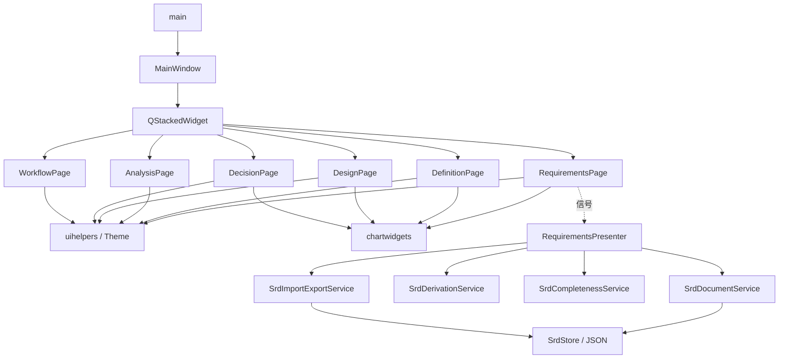

# 架构

## 现状

单进程 Qt Widgets：**main → MainWindow → 六个 Page → uihelpers / Theme / chartwidgets**。  
多数页面仍为 UI 原型（演示数据在 `*page.cpp`，操作多经 `wireDummyAction`）。

**分层样板（已落地）**：设计需求 SRD 是唯一完整的 View→Presenter→Service→本地数据 闭环——`RequirementsPage` → `RequirementsPresenter` → `SrdDocumentService` / `SrdDerivationService` / `SrdCompletenessService` / `SrdImportExportService` → `SrdStore`（`srd_draft.json` + `baselines/`）。其余功能域仍为原型。



**数据流**：

- 原型页：源码字面量 → Page 构造组装 → 屏幕显示；表单可改但不写回模型。
- 设计需求 SRD：四子页编辑 → snapshot 章节 → Presenter → Service 落盘；结果经 Presenter 调用 View 的 `setXxx` 最小刷新；KPI/检查单由 Completeness 按草稿计算；发布写入不可变基线并导出 evaluation-spec。

**配置**：无通用运行时配置 / `QSettings` 业务解析。CMake 固定 AUTOMOC/UIC/RCC、`Qt::Widgets`、include=`./` 与 `./ui`、MinGW UTF-8；第三方 `yaml-cpp`（0.8.0，FetchContent 静态链接）用于评价规格 `evaluation-spec.yaml` 序列化。`main` 设置 `OrganizationName=AMDO`（供 AppData 路径）。硬编码：`Theme`、窗口尺寸、各页演示字段。UI 上的「执行环境/许可证」等仅为演示。

链接依赖 `Qt::Widgets` 与 `yaml-cpp`（静态）。`mainwindow.ui` 未入构建。无 `.qrc`。

## 目录

```text
AMDO/
├── AGENTS.md
├── CMakeLists.txt
├── main.cpp
├── mainwindow.h/.cpp
├── mainwindow.ui           # 未加入 PROJECT_SOURCES
├── model/                  # 本地数据（SRD）
├── service/                # 用例（SRD）
├── controller/             # Presenter（SRD）
├── ui/                     # 页面与公共 UI
│   ├── theme.h
│   ├── uihelpers.*
│   ├── chartwidgets.*
│   └── *page.*
├── docs/
└── build-mingw64/
```

`PROJECT_SOURCES` 须与上表源文件对齐；新增文件必须写入 CMake。

## 模块

| 模块 | 位置 | 核心类型 | 职责 |
|------|------|----------|------|
| 入口 | `main.cpp` | — | QApplication / Theme / 显示主窗 |
| 壳 | `mainwindow.*` | `MainWindow` | 导航、页堆栈、主次按钮 |
| 主题 | `ui/theme.h` | `Theme` | 颜色 + 全局 QSS |
| UI 工厂 | `ui/uihelpers.*` | `SubTabBar` 等 | 面板/表格/KPI/假动作 |
| 图表 | `ui/chartwidgets.*` | `*Chart` 等 | 示意绘制 |
| 设计需求 | `ui/requirementspage.*` | `RequirementsPage` | 任务/包线/规范/指标；托管 SRD 分层 |
| SRD Presenter | `controller/requirementspresenter.*` | `RequirementsPresenter` | 编排 SRD 用例与刷新 |
| SRD Service | `service/srd*.*` | `SrdDocumentService` 等 | 草稿/派生/检查/导入导出 |
| SRD 数据 | `model/srd*` | `SrdDocument` / `SrdStore` / `SrdCatalogs` | POD + JSON + 种子目录 |
| 方案定义 | `ui/definitionpage.*` | `DefinitionPage` | 语义/构型/几何/视图 |
| 方案定义 Presenter | `controller/definitionpresenter.*` | `DefinitionPresenter` | 编排方案用例与刷新 |
| 方案定义 Service | `service/aircraft*.*` | `AircraftDocumentService` / `AircraftImportExportService` / `AircraftCpacsService` | 草稿/基线/导入导出/CPACS 主数据 |
| 方案定义 数据 | `model/aircraft*` | `AircraftDocument` / `AircraftStore` / `AircraftCatalogs` | POD + JSON + 种子目录 |
| 学科分析 | `ui/analysispage.*` | `AnalysisPage` | 六学科侧栏+表单；分层持久化分析集 |
| 学科分析 Presenter | `controller/analysispresenter.*` | `AnalysisPresenter` | 编排加载/保存/校验 |
| 学科分析 Service | `service/analysisdocumentservice.*` | `AnalysisDocumentService` | 分析集草稿读写 + 配置校验 |
| 学科运行计算 | `service/analysiscomputeservice.*` | `AnalysisComputeService` / `IDisciplineComputer` 及六学科计算器 | 逐学科计算：气动/推进/任务性能含真实项，其余 MOCK（详见 business/analysis_compute.md） |
| 学科分析 数据 | `model/analysis*` | `AnalysisDocument` / `AnalysisStore` / `AnalysisCatalogs` / `AnalysisRunResult` | POD + JSON + 六学科目录 + 计算结果 |
| 方案优化 | `ui/designpage.*` | `DesignPage` | 变量/探索/优化/MDO |
| 方案决策 | `ui/decisionpage.*` | `DecisionPage` | 评价/比较/报告 |
| 工作流 | `ui/workflowpage.*` | `WorkflowPage` | 编排/执行/监控 |

落点：顶栏/导航 → `mainwindow.cpp`；样式 → `theme.h`；某功能 → 对应 page；复用 → `uihelpers`/`chartwidgets`；新业务分层 → 对照 SRD 样板。  
改导航索引时同步 `updateActions` 文案；改 `objectName` 同步 `Theme`。

**未实现**：求解器、调度引擎、完整工程文件 IO、网络。

页面组织与内部接口见 [ui.md](ui.md)。分层约束与样板流程见 [frontend_constraints.md](frontend_constraints.md)。

## 目标分层

新业务应落在 `controller/` / `service/` / `model/`，以设计需求 SRD 为样板，禁止继续把用例堆进 Page。

## 风险

- 演示数据分散、Page 文件偏大
- 启动即构造六页（日后可懒加载，TODO）
- 闲置 `.ui` 易误导
- 仅设计需求 SRD 一条链路完成分层，其余仍为原型
- 设计需求已按 SRD 闭环落地；分析/优化/决策尚未消费 evaluation-spec
- 方案定义已分层（View→Presenter→Service→Model）；「创建方案版本」除写 `baselines/aircraft_vN.json` 外，同步产出 CPACS 飞机语义主数据 `cpacs/aircraft_Rxxx.cpacs.xml`（简化子集，QXmlStreamWriter）；「冻结分析用例」将当前方案冻结为不可变 `cases/case_N.input.cpacs.xml`（含 `amdo:case` 登记块，对应 CaseSnapshotBuilder）
- 方案定义尚未派生 STEP/B-Rep/GLB（需 OCCT/TiGL 几何内核，暂不引入）；下游分析/优化/决策三流亦未消费 CPACS/用例快照
- 学科分析已分层（View→Presenter→Service→Model）：六学科配置为「分析集」，「保存分析集」写 `analysis/analysis_draft.json`、「校验配置」做空值/数值/关联检查；结构在 `AnalysisCatalogs` 目录、文档只存字段取值与引用（`sourceRevision` 飞机修订 R00N / `sourceSrd` 设计需求基线 srd_vN / `sourceCase` 用例快照，均为下拉选择、引用而非复制）；「发布分析集版本」冻结为不可变 `analysis/baselines/analysis_vN.json`，版本选择条支持切草稿/只读基线与「另存为新草稿」
- 学科运行计算（`AnalysisComputeService`）：「运行学科计算」按 `sourceRevision` 解析飞机参数；**工况优先取关联 SRD(`sourceSrd`)的飞行包线点（版本条「设计工况」下拉选定），未关联时回退分析集手填**——对齐 PDF「设计工况来自设计需求」。逐学科产出结果写 `analysis/results/`（有用例→`case_N.evaluation.json` 贴 PDF；否则按「修订+需求+工况」组合键命名，不同关联互不覆盖）。**能真算的已真算**：气动(ISA 大气/V/q/AR/Re 精确、L/D 估算)、推进(安装后总推力)、任务性能(起飞/着陆场长余量)；结构/重量/操稳及气动 CL-CD/SFC/航程等**缺求解器或关键输入的仍为 MOCK 占位**。接口已按六学科全面定义，后期逐项替换（TODO 见代码与 `business/analysis_compute.md`）
